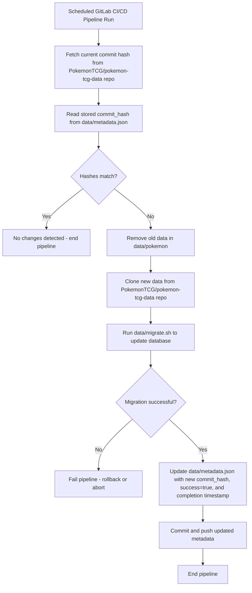

# TCG Decklists Data

This directory contains the data used for the card list. The data is sourced
from https://github.com/PokemonTCG/pokemon-tcg-data.

## Metadata

`metadata.json` keeps track of the most recent ingestion of the data and is
updated whenever the pipeline is run to update the database.

```json
{
    "url": "https://github.com/PokemonTCG/pokemon-tcg-data",
    "commit_hash": "37d13b7cd2ff04c41a319ecf9b5d854328a8a390",
    "last_updated": "2025-10-09 23:59:59.123456+00:00",
    "successful": "true"
}
```

## Pipeline


