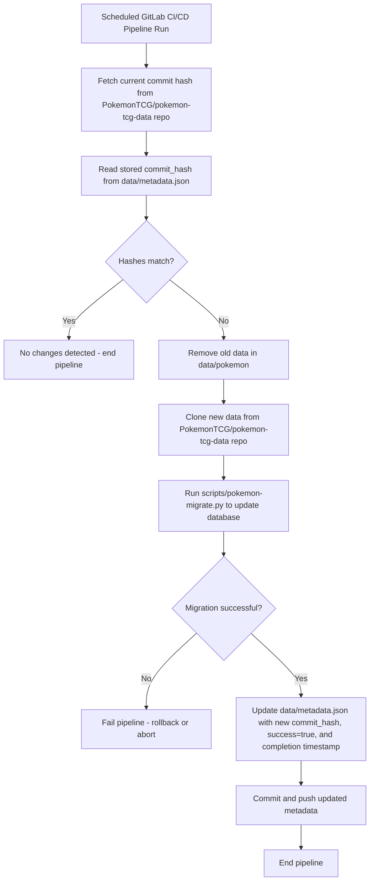

# TCG Decklists Data

This directory contains the data used for the card list. The data is sourced
from https://github.com/PokemonTCG/pokemon-tcg-data.

## Metadata

`metadata.json` records the latest data ingestion and is updated each time the pipeline runs to refresh the database.

```json
[
  {
    "name": "pokemon",
    "source": "https://github.com/PokemonTCG/pokemon-tcg-data",
    "context": "cards/en",
    "version": "37d13b7cd2ff04c41a319ecf9b5d854328a8a390",
    "successful": true,
    "timestamp": "2025-09-26T15:37:58Z"
  }
]
```

## Pipeline


