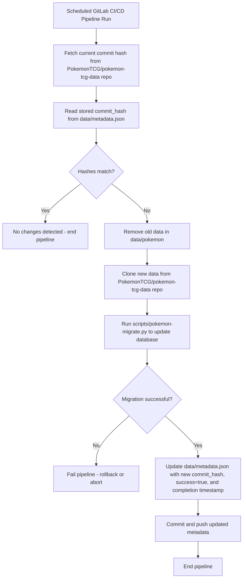

# TCG Decklists Data

This directory contains the data used for the card list. The data is sourced
from https://github.com/PokemonTCG/pokemon-tcg-data.

## TODO

Get set details from https://github.com/PokemonTCG/pokemon-tcg-data/tree/master/sets.

Can be stored in `pokemon_set` table.

## Metadata

`metadata.json` records the latest data ingestion and is updated each time the pipeline runs to refresh the database.

```json
[
  {
    "name": "pokemon",
    "source": "https://github.com/PokemonTCG/pokemon-tcg-data",
    "context": "cards/en",
    "version": "37d13b7cd2ff04c41a319ecf9b5d854328a8a390",
    "successful": true,
    "timestamp": "2025-09-26T15:37:58Z"
  }
]
```

## Validation

After loading or updating card data, you can validate that all cards are correctly stored and served by the API:

```bash
# From the project root
cd tools/api-testing
node validate-all-cards.js
```

This script:

1. Loads all source card data from `pokemon/*.json`
2. Queries the API for each card
3. Compares API responses against source data
4. Reports any mismatches or errors

See [tools/api-testing/README.md](../api-testing/README.md) for more details.

## Pipeline


