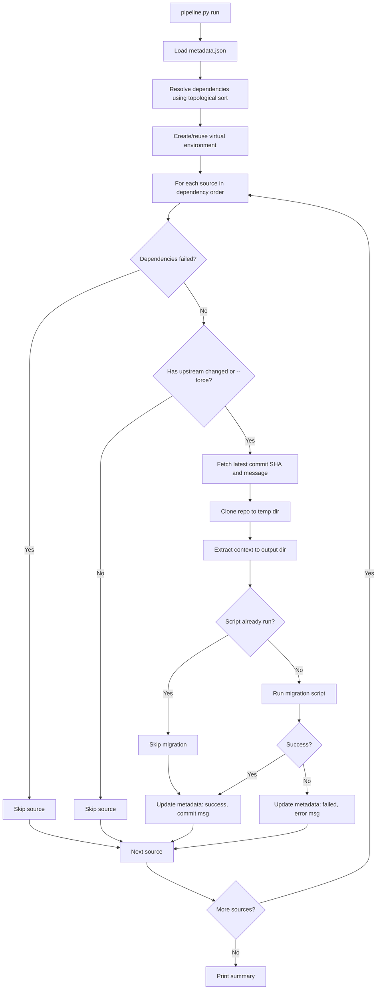

# TCG Decklists Data Pipeline

This directory contains the data pipeline for importing TCG card and set data into the database.

## Directory Structure

```
data-pipeline/
├── data/                           # Raw downloaded data (gitignored)
│   └── pokemon/
│       ├── cards/                  # Card JSON files
│       └── sets/                   # Set metadata
│           └── en.json
├── scripts/                        # Migration scripts organized by TCG
│   └── pokemon/
│       ├── _migrate_lib.py         # Shared migration logic
│       ├── migrate-sets.py         # Sets migration script
│       └── migrate-cards.py        # Cards migration script
├── pipeline_lib/                   # Pipeline core library
│   ├── __init__.py
│   ├── metadata.py                 # Metadata management
│   ├── github.py                   # GitHub API integration
│   ├── downloader.py               # Data downloading
│   ├── executor.py                 # Script execution
│   └── dependencies.py             # Dependency resolution
├── schema/                         # Auto-generated JSON schemas (optional)
├── metadata.json                   # Pipeline configuration and version tracking
├── requirements.txt                # Python dependencies
├── pipeline.py                     # Main pipeline CLI (executable)
└── venv/                           # Python virtual environment (created on first run)
```

## Data Sources

### Pokémon TCG

- **Source**: https://github.com/PokemonTCG/pokemon-tcg-data
- **Card data**: English card JSON files from `cards/en/`
- **Set data**: Set metadata from `sets/en.json`

## Metadata Configuration

`metadata.json` defines data sources and tracks ingestion status:

```json
[
  {
    "name": "pokemon-sets",
    "source": "https://github.com/PokemonTCG/pokemon-tcg-data",
    "context": "sets",
    "output": "data/pokemon/sets",
    "script": "scripts/pokemon/migrate-sets.py",
    "dependencies": [],
    "version": "37d13b7cd2ff04c41a319ecf9b5d854328a8a390",
    "commit_message": "Update set data for Scarlet & Violet",
    "successful": true,
    "error_message": null,
    "timestamp": "2025-09-26T15:37:58Z"
  },
  {
    "name": "pokemon-cards",
    "source": "https://github.com/PokemonTCG/pokemon-tcg-data",
    "context": "cards/en",
    "output": "data/pokemon/cards",
    "script": "scripts/pokemon/migrate-cards.py",
    "dependencies": ["pokemon-sets"],
    "version": "37d13b7cd2ff04c41a319ecf9b5d854328a8a390",
    "commit_message": "Update set data for Scarlet & Violet",
    "successful": true,
    "error_message": null,
    "timestamp": "2025-09-26T15:37:58Z"
  }
]
```

**Fields:**

- `name`: Unique identifier for this data source
- `source`: Git repository URL
- `context`: Subdirectory within the repo to extract
- `output`: Local directory where data will be stored
- `script`: Python migration script to run (shared scripts run only once per pipeline execution)
- `dependencies`: Array of source names that must run successfully before this source
- `version`: Git commit hash of last successful import
- `commit_message`: First line of the commit message from the source repository
- `successful`: Whether last import succeeded
- `error_message`: Error details if the migration failed (null on success)
- `timestamp`: Last import timestamp

## Running the Pipeline

### Basic Usage

Run the pipeline to check for updates and migrate new data:

```bash
cd tools/data-pipeline
python pipeline.py run
```

### Force Mode

Force re-download and re-migrate all data, ignoring version tracking:

```bash
python pipeline.py run --force
```

### Check Status

View the current status of all data sources:

```bash
python pipeline.py status
```

### What the Pipeline Does

1. **Resolves dependencies**: Orders data sources based on their dependencies
2. **Checks for updates**: Fetches latest commit hash and message from source repositories
3. **Downloads data**: If updates are available (or in force mode), clones the repo and extracts data
4. **Runs migrations**: Executes Python migration scripts in dependency order
5. **Updates metadata**: Records new version, commit message, success status, and any errors

## How It Works

### Dependency Resolution

The pipeline uses topological sorting to determine the correct execution order based on the `dependencies` field in metadata.json. For example:

- `pokemon-sets` has no dependencies, so it runs first
- `pokemon-cards` depends on `pokemon-sets`, so it runs after sets complete successfully

If a circular dependency is detected, the pipeline will abort with an error.

### Version Tracking

Each data source tracks the Git commit SHA of the last successful import. The pipeline:

1. Fetches the latest commit information from GitHub (including commit message)
2. Compares it with the stored version
3. Only re-downloads and re-migrates if the version has changed (unless `--force` is used)

### Error Handling

- Failed migrations are recorded in `error_message` with detailed error information
- Sources that depend on failed sources are automatically skipped
- The pipeline continues processing independent sources even if some fail
- Metadata is always updated, even on failure, to track the attempted migration

### Virtual Environment

On first run, the pipeline creates a Python virtual environment and installs dependencies from `requirements.txt`. This environment is reused on subsequent runs for better performance.

## Validation

After loading or updating card data, validate that all cards are correctly stored:

```bash
# From the project root
cd tools/api-testing
node validate-all-cards.js
```

See [tools/api-testing/README.md](../api-testing/README.md) for more details.

## Pipeline Flow


