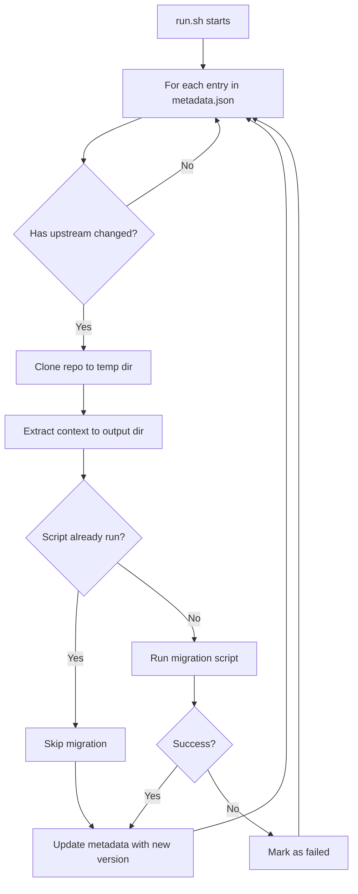

# TCG Decklists Data Pipeline

This directory contains the data pipeline for importing TCG card and set data into the database.

## Directory Structure

```
data-pipeline/
├── data/                           # Raw downloaded data (gitignored)
│   └── pokemon/
│       ├── cards/                  # Card JSON files
│       └── sets/                   # Set metadata
│           └── en.json
├── scripts/                        # Migration scripts organized by TCG
│   └── pokemon/
│       └── migrate.py              # Pokemon data migration script
├── schema/                         # Auto-generated JSON schemas (optional)
├── metadata.json                   # Pipeline configuration and version tracking
├── requirements.txt                # Python dependencies
└── run.sh                          # Main pipeline runner
```

## Data Sources

### Pokémon TCG

- **Source**: https://github.com/PokemonTCG/pokemon-tcg-data
- **Card data**: English card JSON files from `cards/en/`
- **Set data**: Set metadata from `sets/en.json`

## Metadata Configuration

`metadata.json` defines data sources and tracks ingestion status:

```json
[
  {
    "name": "pokemon-cards",
    "source": "https://github.com/PokemonTCG/pokemon-tcg-data",
    "context": "cards/en",
    "output": "data/pokemon/cards",
    "script": "scripts/pokemon/migrate.py",
    "version": "37d13b7cd2ff04c41a319ecf9b5d854328a8a390",
    "successful": true,
    "timestamp": "2025-09-26T15:37:58Z"
  },
  {
    "name": "pokemon-sets",
    "source": "https://github.com/PokemonTCG/pokemon-tcg-data",
    "context": "sets",
    "output": "data/pokemon/sets",
    "script": "scripts/pokemon/migrate.py",
    "version": "37d13b7cd2ff04c41a319ecf9b5d854328a8a390",
    "successful": true,
    "timestamp": "2025-09-26T15:37:58Z"
  }
]
```

**Fields:**

- `name`: Unique identifier for this data source
- `source`: Git repository URL
- `context`: Subdirectory within the repo to extract
- `output`: Local directory where data will be stored
- `script`: Python migration script to run (shared scripts run only once per pipeline execution)
- `version`: Git commit hash of last successful import
- `successful`: Whether last import succeeded
- `timestamp`: Last import timestamp

## Running the Pipeline

```bash
cd tools/data-pipeline
./run.sh
```

The script will:

1. Check for updates to configured data sources
2. Download changed data to the appropriate `output` directories
3. Run migration scripts to update the database
4. Update `metadata.json` with new version info

## How It Works

1. **Check for updates**: Fetches latest commit hash from source repositories
2. **Download data**: If updates are available, clones the repo and extracts the specified `context` path to the
   `output` directory
3. **Run migrations**: Executes the specified Python migration script
    - If multiple data sources share the same script, it runs only once
    - Sets are always migrated before cards for FK integrity
4. **Update metadata**: Records new version hash, success status, and timestamp

## Validation

After loading or updating card data, validate that all cards are correctly stored:

```bash
# From the project root
cd tools/api-testing
node validate-all-cards.js
```

See [tools/api-testing/README.md](../api-testing/README.md) for more details.

## Pipeline Flow


